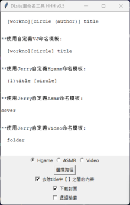
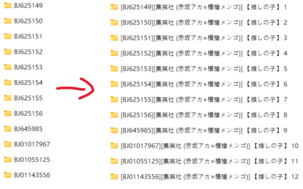
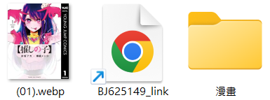

## DLsite 重命名工具 Readme

這個程式碼是一個用於 DLsite 作品重命名的工具，可以自動從 DLsite 網頁爬取作品資訊，並根據設定的模板重新命名作品資料夾，同時下載封面圖片和建立 URL 連結檔案。

**主要功能：**

*   **自動從 DLsite 網頁爬取作品資訊：** 包括作品標題、社團、聲優、作者、年齡分級、發售日期和作品類型。
*   **根據設定的模板重新命名作品資料夾：** 可以自訂模板，例如 "workno title (circle)"，程式會自動將 "workno"、"title" 和 "circle" 替換成對應的作品資訊。
*   **下載多張封面圖片：** 可選擇是否下載封面，並支援下載多張範例圖片。
*   **建立 URL 連結檔案：** 程式會在作品資料夾中建立一個 URL 連結檔案，方便快速開啟 DLsite 作品頁面。
*   **支援遞迴檢索：** 可以選擇是否遞迴檢索子資料夾，方便一次性重命名多個作品。
*   **去除標題中的特殊符號：** 可以選擇是否去除標題中的 "【】" 符號。
*   **多種作品類型支援：** 支援 Hgame、ASMR 和 Video 三種作品類型，並可根據不同類型套用不同的命名模板。
*   **圖像格式轉換：** 可將下載的 JPG 格式封面圖片轉換為 WebP 格式，並刪除原始 JPG 檔案。

**使用方法：**

1.  執行程式。
2.  選擇作品類型
3.  設定額外選項 (是否去除【】中間內容，是否下載封面，是否遞迴檢索)。
4.  點擊 "選擇路徑" 按鈕，選擇要重命名的作品資料夾。
5.  程式會自動爬取作品資訊、重命名資料夾、下載封面和建立 URL 連結檔案。

**注意事項：**

*   程式需要網路連線才能正常運作。
*   請確保作品資料夾名稱符合程式碼中的正則表達式regax規則，否則程式無法正確識別作品編號。

**配置文件：**

程式使用 JSON 格式的配置文件來儲存命名模板和其他設定。

*   `config_Hgame.json`：Hgame 作品的配置文件。
*   `config_ASMR.json`：ASMR 作品的配置文件。
*   `config_Video.json`：Video 作品的配置文件。
*   `config_by_jerry.json`: Jerry 自定義的配置文件。

**其他說明：**

*   程式碼中使用了多個第三方庫，例如 `tkinter`、`lxml`、`requests`、`PIL` 等。
*   程式碼中包含多個函數，例如 `match_code()`、`nameChange()`、`read_config()` 等，每個函數都有詳細的註釋說明其功能。
